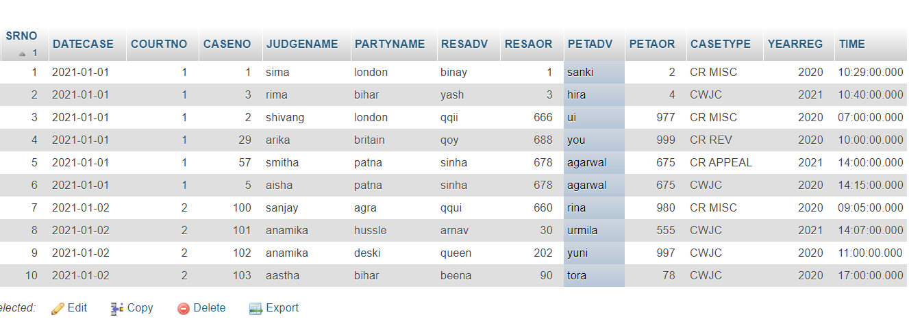
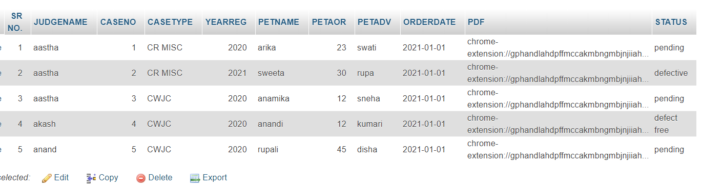
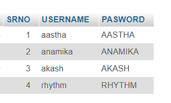

# COURT CASE ACCESS SYSTEM FOR NORMAL USERS
An easy access for those people who are not able to directly access the details that are used on a daily basis. The main reason is because the main court websites have so many unnessessary buttons which makes it difficult to access few things easily.  

### Tech Stacks Used
* PHP ( backend )
* mySQL ( backend )
* HTML ( frontend )
* CSS ( frontend )
* JS ( frontend )

### Website live at
http://hacknitp-savengers.freecluster.eu/

### Database

* CAUSELIST DATABASE

* ORDER & CASE STATUS DATABASE

* LOGIN DATABASE

### PPT LINK
https://drive.google.com/file/d/1cVZf4ypzmJ3BHwUX5lcEoKSNXJy1yADC/view

### YOUTUBE LINK (video explanation)
https://youtu.be/b4gJ2emUZGg

### DETAILS FOR DATABASE CHECKING
*  GO TO (CAUSE LIST)--> (COURT NUMBER WISE) -->ENTER (2020-01-01)---> ENTER COURT NUMBER 1 ---->  RESULT
*  GO TO (ORDER LIST)--> (JUDGE NAME WISE) --> ENTER ( The justice Aastha )---> RESULT
*  GO TO (CASE STATUS)--> (CASE NUMBER WISE) --> ENTER (CASE NUMBER 1)----> (YEAR 2020) ---> RESULT

### MADE BY TEAM SAVENGERS

